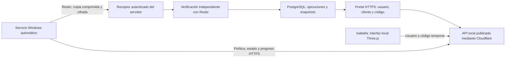

# Instalación de Isabella en Windows

El paquete actual está en `agent/dist/Isabella-Setup.exe`. Incluye Restic y la interfaz Three.js; el equipo del cliente no necesita Go, Node.js ni ejecutar scripts.

1. Copia `Isabella-Setup.exe` al disco local del equipo que vas a respaldar.
2. Haz doble clic. Acepta el aviso de administrador de Windows. Si usas una cuenta estándar, Windows pedirá credenciales de un administrador del equipo.
3. El instalador copia la aplicación a `C:\Program Files\JC Enterprise\Backup Agent`, registra `JCEnterpriseIsabella` con inicio automático y abre `http://127.0.0.1:18443`.
4. En el portal `https://www.jcevnzl.space`, inicia sesión y entra en **Respaldos con Isabella**. Selecciona el cliente y pulsa **Generar código de vinculación**. El código vence en diez minutos y solo se puede usar una vez.
5. En Isabella, inicia sesión con tu usuario y contraseña del portal. Escribe el nombre del equipo y el código de seis dígitos. El usuario debe tener acceso al cliente elegido.
6. Indica las carpetas absolutas, los días y la hora local. Guarda la política para activar el respaldo. Las credenciales del equipo se guardan protegidas con DPAPI.
7. Consulta el equipo y sus ejecuciones en el portal. Una copia pasa a **verificando** cuando llega; solo pasa a **verificada** después de la comprobación del servidor.

Puedes cerrar la ventana del navegador: el servicio mantiene las tareas. Al abrir de nuevo el ejecutable, se abre la interfaz del servicio existente.

Para comprobar el servicio, abre `services.msc` y busca **JC Enterprise Isabella**. Para diagnosticar una instalación fallida, revisa `C:\ProgramData\JCEnterprise\backup-agent\install.log`. El instalador muestra un mensaje si no puede completar la instalación.

## Flujo

## Validación de esta entrega

- 46 pruebas Node pasaron, incluyendo la creación de un repositorio real, copia comprimida, comprobación de integridad y restauración con bytes idénticos.
- Las pruebas Go pasaron, incluyendo el inicio y parada del manejador del servicio de Windows.
- El ejecutable se compiló y su interfaz local se abrió sin errores gráficos.
- El backend publicado respondió correctamente; Vercel marcó el commit `1aa8375` como Ready en producción.
- La instalación elevada se confirmó: el servicio quedó Running con inicio Automatic y su interfaz respondió correctamente.
- El portal permite configurar carpetas, horario, días, compresión y retención por equipo, además de solicitar un respaldo inmediato.
- La restauración desde el portal se realiza en una carpeta nueva del servidor y verifica los archivos restaurados. La retención solo cuenta copias verificadas.
- Falta comprobar la vinculación con una cuenta real y un reinicio del equipo sin sesión abierta. Los destinos SFTP/S3 y un instalador Linux no están incluidos en el paquete Windows.
