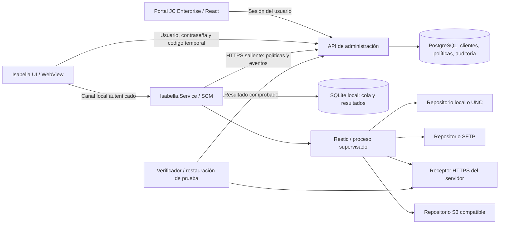

# Isabella: servicio independiente y panel por cliente

Estado: diseño para revisión; no es una entrega instalada ni verificada.

## Objetivo y alcance

Aplicar la especificación entregada por el usuario al sistema JC Enterprise existente. El portal principal sigue siendo www.jcevnzl.space y la fuente de clientes sigue siendo su PostgreSQL. Isabella ejecuta respaldos y transmite su estado aunque no haya usuario conectado ni interfaz abierta.

El nuevo diseño visual sustituye los acentos rojos por gris oscuro y azul eléctrico; la representación es una nube de puntos sin rostro, con movimiento sutil dependiente del estado real.

El entorno objetivo inicial es Windows y Windows Server del usuario. La capa de ejecución se diseña portable, pero Linux solo se declara soportado después de entregar unidad systemd, almacenamiento de secretos y pruebas específicas en una máquina Linux.

## Evidencia del estado actual

- El agente actual es Go y ejecuta interfaz y trabajo en un mismo proceso. El script de instalación crea una tarea programada; no registra un servicio nativo SCM.
- El login contra el portal y código de un solo uso tienen pruebas de permiso por cliente. Se conservan esos contratos.
- El portal tiene listado básico de equipos, actividad y alertas; aún no ofrece editor completo de destinos y horarios.
- Un resultado informado por el agente queda en verifying; falta comprobación independiente del contenido recibido.
- La reconciliación de eventos programados sin conexión puede recibir 409, por falta de transición entre queued y running.
- No se ha acreditado instalación sin sesión, recuperación tras reinicio ni restauración completa desde el receptor público.

## Elección de implementación

1. **C#/.NET Worker Service + React/WebView: propuesta elegida.** Cumple el entregable de servicio C#/.NET y separa UI y motor. Conservar Restic evita reescribir cifrado, compresión y formato de respaldo. Requiere portar el pequeño coordinador Go, probar DPAPI bajo la cuenta real del servicio y preparar el entorno .NET, que no está disponible actualmente en este checkout.
2. Mantener Go y añadir SCM: menor cambio, pero no entrega el servicio Python/C#/.NET solicitado.
3. Python empaquetado: viable, pero añade un runtime y un envoltorio de servicio sin ventaja clara para el entorno Windows actual.

La selección exacta de SDK y WebView se valida contra la versión de Windows Server antes de instalar dependencias. Distribución autocontenida: el usuario no necesita Go, Python o SDK de .NET.

## Componentes y flujo



La UI nunca recibe conexión directa a PostgreSQL ni credenciales globales. Lee clientes autorizados mediante API. Un cliente final ve solo su organización; operadores con permiso explícito pueden seleccionar clientes. La lista se actualiza por revisión y consultas periódicas; no se promete entrega instantánea cuando no hay conexión.

El servicio no abre navegadores ni ventanas desde la sesión 0. El lanzador de escritorio abre la UI; cerrarla no detiene el servicio. El instalador único instala motor, Restic y UI, registra inicio automático y políticas de recuperación, comprueba salud y abre el asistente en la sesión interactiva.

## Identidades y secretos

- Código temporal de diez minutos, de un solo uso, ligado al cliente.
- Usuario y contraseña validados por el portal, con límite de intentos. Se exige permiso sobre el cliente del código antes de consumirlo.
- La contraseña no se guarda ni se entrega al servicio; el servicio recibe token revocable y credenciales limitadas al repositorio.
- Secretos protegidos bajo la identidad del servicio y ACL verificadas. No asumir que DPAPI de usuario interactivo puede leerse como servicio.
- IPC local por named pipe con ACL; la UI sin autorización no puede activar tareas ni consultar datos de otro cliente.
- Acceso UNC bajo cuenta de servicio explícita con permisos comprobados; no usar unidades mapeadas de una sesión de escritorio.
- Claves de repositorio recuperables mediante copia cifrada administrada; retirar un equipo no borra sus copias.

## Configuración por cliente y equipo

Una organización puede tener varios equipos. Cada política referencia cliente, equipo y destino; repositorios y claves permanecen separados por equipo. El cliente no elige una ruta arbitraria del servidor receptor: el backend asigna un subdirectorio dentro del almacenamiento autorizado.

Ejemplo del contrato propuesto, sin secretos:

```json
{
  "clientId": "cli-001",
  "deviceId": "00000000-0000-4000-8000-000000000001",
  "policyId": "policy-001",
  "revision": 1,
  "enabled": false,
  "sourceDirs": ["C:\\Datos"],
  "excludes": ["*.tmp"],
  "destinationId": "destination-001",
  "schedule": {
    "kind": "weekly",
    "days": [1, 2, 3, 4, 5],
    "time": "22:00",
    "timezone": "America/Caracas"
  },
  "compression": "auto",
  "retentionSuccessfulCount": 7,
  "consistencyProfile": "files",
  "retry": {"maxAttempts": 2, "delaySeconds": 900}
}
```

Destinos persistidos aparte: id, clientId, tipo, ruta/endpoint, referencia de secreto y resultado de validación. Tipos iniciales: local/UNC y receptor HTTPS existente. Adaptadores SFTP y S3 tienen pruebas independientes antes de aparecer como disponibles. FTP sin cifrado no forma parte del perfil predeterminado; no se etiquetará SFTP como si fuera FTP.

Horarios admitidos: diaria, semanal y cada N minutos (mínimo 15), con fecha de anclaje para intervalos. Guardar UTC para eventos y zona IANA para horario civil. El cambio de política aplica a próximas ocurrencias y conserva la revisión de las ejecuciones en curso.

## Servicio y programador

Worker asíncrono con tareas separadas para heartbeat, lectura de políticas, ejecución y envío de resultados. Un error de envío no detiene heartbeat ni consultas. Un único respaldo simultáneo por repositorio; concurrencia global limitada y configurable.

SQLite local almacena ocurrencia estable, revisión, intento, identificador de snapshot y eventos pendientes. Clave idempotente: equipo + política/revisión + instante programado. Como máximo una tentativa inicial y un reintento después de quince minutos; reenviar un evento no consume una tentativa.

El servidor admite reconciliar una ejecución offline antes de aceptar eventos. Al reiniciar, el servicio consulta diario y snapshots etiquetados antes de repetir. Un snapshot ya creado se reconcilia; no dispara un tercer intento.

Estados: queued, preparing, running, retry_wait, verifying, succeeded, failed y cancelled. succeeded requiere comprobación del repositorio; un exit code 0 del agente solo permite pasar a verifying. Captura de salida en streaming con límite de memoria, timeout y cancelación ordenada de procesos hijos.

La retención solo elimina versiones verificadas excedentes. Un fallo no borra la última copia válida. Las bases de datos abiertas requieren perfiles probados (dump/VSS según motor); una copia de archivos no se presenta como respaldo consistente de base de datos.

## UI y nube de puntos

React compartido entre portal y WebView, con transporte API/IPC separado. Fondo #10141C, superficies #19212E, textos #E6EDF7 y acento #39BFFF. Contraste legible y estados con texto, no solo color.

Panel: buscador de clientes autorizados, equipos, estado del servicio, última/ próxima ejecución y destino. Editor: carpetas, prueba de acceso, destino, frecuencia, retención y compresión. Historial: duración, tamaño original, bytes añadidos, resultado de verificación y detalle de error. Auditoría: quién cambió una política y qué revisión ejecutó el equipo.

Nube sin rostro mediante WebGL con límite de partículas y fallback Canvas. Movimiento lento en reposo, leve expansión al trabajar, pulsos suaves en eventos y señal textual de error. Respeta prefers-reduced-motion, detiene render cuando la vista no es visible y limita FPS. El estado deriva de la API, nunca de temporizadores que simulen progreso.

Isabella es un asistente guiado por estados y comprobaciones. No se añade un modelo de IA remoto ni envío de nombres/rutas a terceros para producir conversación; voz o chat libre serían requisitos adicionales.

## Entregables y secuencia

1. Diagrama y contratos de política/destino con migración aditiva en PostgreSQL.
2. Proyecto C# del servicio, cola persistente, supervisor Restic y pruebas de reinicio/reconciliación.
3. Endpoints de clientes autorizados, políticas, destinos, eventos y auditoría; pruebas de aislamiento por cliente.
4. Prototipo React/WebView gris/azul y nube, conectado a estados reales. Datos de demostración claramente identificados.
5. Instalador EXE autocontenido con reparación y desinstalación que conserve datos por defecto.
6. Receptor y verificador; respaldo de dos versiones, corte de red, reinicio sin login y restauración comparada por SHA-256.
7. Publicación coordinada de backend, portal y ejecutable después de cumplir la aceptación; conservar rollback del portal y binarios anteriores.

## Criterios de aceptación

- Ejecutar un único instalador en una máquina limpia sin herramientas de desarrollo.
- Reiniciar Windows, no iniciar sesión y comprobar desde el portal heartbeat y un respaldo programado.
- Cerrar UI sin detener ejecución; impedir dos instancias del motor trabajando sobre el mismo repositorio.
- Rechazar contraseña incorrecta, código vencido/reutilizado y cliente ajeno.
- Reflejar cambios de clientes y políticas autorizadas en ambos paneles.
- Probar carpetas con espacios y Unicode, destino UNC inaccesible, poco espacio y credenciales revocadas.
- Cortar red durante transferencia y antes del acuse; conservar contadores y reconciliar sin duplicar snapshots.
- Restaurar dos versiones con archivos añadidos/modificados/borrados y comparar hashes; conservar evidencia de prueba.
- No presentar como implementado ni publicado un adaptador, servicio o restauración pendiente de prueba.

## Revisión propia

La propuesta cumple los cuatro entregables del usuario y conserva dominio, clientes, permisos y formato Restic actuales. Se hace explícita la sustitución Go → C# del motor, el alcance Windows inicial y la distinción entre prototipo y servicio instalado. Linux y cada destino adicional tienen una puerta de validación propia; no dependen de afirmar que el prototipo Windows los soporta.
